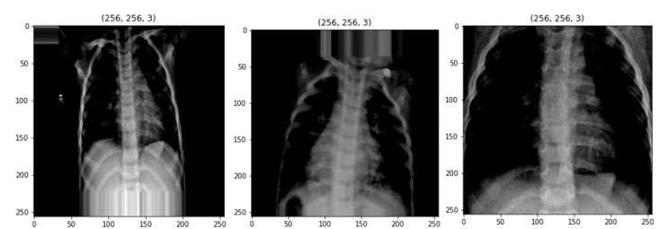

# pneumonia-detection
#   Pneumonia Detection with Deep Learning 🩺

This project tackles the challenge of pneumonia detection using the power of Convolutional Neural Networks (CNNs) and Flask web development.  

## The Mission 

- Build a web application that accepts chest X-ray image uploads.
- Accurately predict the presence or absence of pneumonia in the uploaded image.

## The Strategy ⚔️

1. **Data Acquisition:** 
   - We leverage a labeled dataset of chest X-ray images, meticulously categorized between pneumonia and normal cases.

2. **Data Preparation:** 
   - To ensure the model's learning prowess, we meticulously preprocess the data using:
      - **Image Augmentation:** Techniques like rotation, scaling, and flipping are employed to diversify the dataset and prevent overfitting.
      - **Normalization:** Pixel values are normalized for better convergence during training.
                                                     

3. **Model Selection:** 
   - Two CNN models, InceptionV3 and VGG16, go head-to-head. InceptionV3 emerges victorious due to:
      - **Architectural Suitability:** Handles complex and diverse image datasets effectively.
      - **Prediction Accuracy:** Delivers reliable and accurate predictions.
      - **Training Efficiency:** Requires fewer training epochs compared to VGG16.

4. **Model Building (InceptionV3):** ️
   - We leverage the pre-trained InceptionV3 architecture and strategically add custom layers for the specific task:
      - **Freezing Pre-trained Layers:** Retains valuable features learned by InceptionV3.
      - **Custom Layers:** Adapts the model to binary classification (pneumonia or normal).

5. **Web Development (Flask):** 
   - Flask empowers us to create a user-friendly web application:
      - **HTML Templates:** Design the user interface for image upload and prediction display.
      - **Flask Routes & Functions:** Handle user interaction, image processing, and prediction rendering.

## The Outcome
| Model Architecture | Train Data Epochs (Early Stopping) | Prediction Result |
|---|---|---|
| Inception V3 | 15 | True Positive (TP) |
| VGG16 | 29 | High False Positive (FP) |

True Positive (TP): In binary classification, this refers to cases where the model correctly predicted the presence of pneumonia.

High False Positive (FP) Rate: This suggests the model might be overfitting and misclassifying some normal cases as pneumonia.

In conclusion, a web application that empowers users to upload chest X-ray images and receive predictions on the presence of pneumonia. This is a valuable tool to assist in the diagnosis process, but it's crucial to consult a healthcare professional for definitive medical advice.

## License
This project is licensed under the MIT License. See the [LICENSE](LICENSE) file for details.

## Ready to Dive Deeper? 

Explore the codebase to delve into the intricacies of the project!
